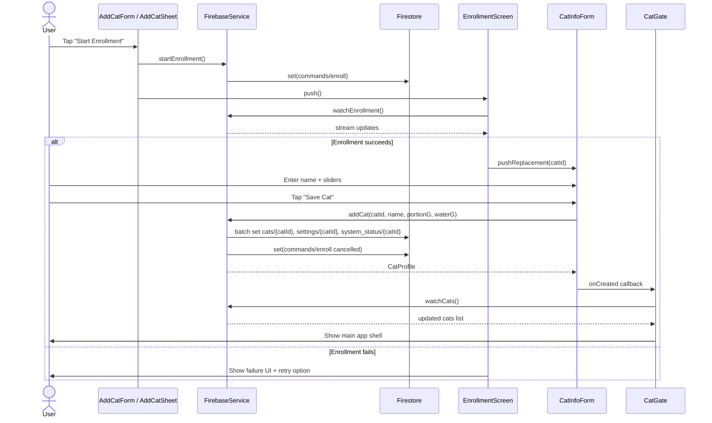

# Add New Cat Process

This document describes the current implementation of adding a new cat in the Flutter app. It is based only on the code in the repository and does not assume any extra behavior.

## Overview

When a user adds a new cat, the app does not collect the cat information immediately. Instead, it starts an enrollment process that is driven by the Raspberry Pi feeder. The Flutter app sends a command to Firebase, the feeder camera performs face recognition, and the Pi reports back with a cat ID. After recognition succeeds, the app asks the user for the cat's name and feeding defaults, then saves a cat profile to Firestore.

The complete workflow is:

1. The user opens the add-cat experience from the onboarding screen or the cat switcher sheet.
2. The app tells Firebase to start enrollment by writing a command document.
3. The Raspberry Pi watches that command, performs face recognition, and updates the enrollment document.
4. When recognition succeeds, the app navigates to a form where the user enters a cat name and feeding amounts.
5. The app writes the new cat to Firestore, creates per-cat settings and system status documents, and then cancels the enrollment command.
6. The app's cat list stream updates, and the app switches from the onboarding experience to the main shell.

## User Flow

### 1. Starting the process

The user starts the process in one of two places:

- On first launch, if no cats are registered, the app shows [app/lib/screens/onboarding/add_cat_screen.dart](app/lib/screens/onboarding/add_cat_screen.dart), which embeds [app/lib/widgets/add_cat_sheet.dart](app/lib/widgets/add_cat_sheet.dart).
- From the cat switcher UI, which is shown by [app/lib/widgets/cat_switcher.dart](app/lib/widgets/cat_switcher.dart), the user can tap the “Add New Cat” entry.

### 2. Initial screen shown

The user sees a short explanation screen that says the feeder camera will recognize the cat first. The screen contains:

- A title: “Recognize your cat first”
- A descriptive paragraph explaining that the feeder will capture the cat’s face and recognize them
- An informational note about making sure the feeder is powered on and the camera has a clear view
- A button labeled “Start Enrollment”

### 3. What the user enters at this stage

At this stage, the user does not enter a name or feeding values. The only action is to press “Start Enrollment”.

### 4. Validation at this stage

The app validates only that the enrollment request can be started. If the Firebase call fails, it shows an error message:

- “Could not start enrollment: …”

### 5. Enrollment screen

After the button is pressed, the app navigates to [app/lib/screens/enrollment/enrollment_screen.dart](app/lib/screens/enrollment/enrollment_screen.dart). The user sees a progress/instruction screen while the feeder is working.

The user can:

- Wait for the feeder to finish recognition
- Press “Cancel” to abort the process
- On failure, press “Try Again”

### 6. Final information entry

Once the Raspberry Pi reports that enrollment is complete and includes a `cat_id`, the app navigates to [app/lib/screens/enrollment/cat_info_form.dart](app/lib/screens/enrollment/cat_info_form.dart).

The user then:

- Enters a cat name in a text field
- Uses two sliders to choose:
  - Default Portion
  - Water Bowl Capacity
- Presses “Save Cat”

### 7. What happens after pressing Save Cat

When the user presses “Save Cat”:

- The app trims the entered name and checks that it is not empty.
- If valid, it calls the Firebase service to save the cat.
- It then cancels the enrollment document.
- The app notifies the parent callback if present.
- The `cats` stream updates, and the app eventually switches to the main shell because the root gate sees that at least one cat exists.

## Screen Architecture

| Screen / UI Surface | File | Class / Widget | Purpose |
|---|---|---|---|
| Onboarding entry screen | [app/lib/screens/onboarding/add_cat_screen.dart](app/lib/screens/onboarding/add_cat_screen.dart) | `AddCatScreen` | Shows the initial onboarding experience when no cats are registered. |
| Add-cat bottom sheet | [app/lib/widgets/add_cat_sheet.dart](app/lib/widgets/add_cat_sheet.dart) | `AddCatForm`, `AddCatSheet` | Presents the initial “start enrollment” UI and launches the enrollment flow. |
| Cat switcher sheet | [app/lib/widgets/cat_switcher.dart](app/lib/widgets/cat_switcher.dart) | `CatSwitcher` | Lists existing cats and offers the “Add New Cat” action from inside the app. |
| Enrollment progress screen | [app/lib/screens/enrollment/enrollment_screen.dart](app/lib/screens/enrollment/enrollment_screen.dart) | `EnrollmentScreen` | Watches the enrollment command document and shows progress or failure. |
| Cat info form | [app/lib/screens/enrollment/cat_info_form.dart](app/lib/screens/enrollment/cat_info_form.dart) | `CatInfoForm` | Collects the cat name and feeding defaults and saves the cat to Firestore. |
| Root gate | [app/lib/app.dart](app/lib/app.dart) | `CatGate` | Watches the `cats` collection and decides whether to show onboarding or the main app. |

## UI Components

The add-cat flow uses the following important UI elements:

- `Text` widgets for headings and explanatory text
- `ElevatedButton` for “Start Enrollment” and “Save Cat”
- `OutlinedButton` for “Cancel” and “Try Again”
- `TextField` for the cat name
- `Slider` widgets for portion and water values
- `CircularProgressIndicator` while enrollment or save is in progress
- `AppBar` and `Scaffold` for screens and forms
- `SingleChildScrollView` and `SafeArea` for layout
- `Container` and `BoxDecoration` for cards and status panels

Important note: the current implementation does not use:

- A dropdown
- A form widget such as `Form`
- An image picker
- A file uploader
- Any camera capture widget in Flutter

## State Management

The add-cat flow does not use a provider package such as Riverpod or Provider. State is handled locally in the widget classes and through Firebase streams.

### Local state in `AddCatForm`

The widget stores:

- `_isStarting`: whether enrollment is being started
- `_error`: the last error message to show

### Local state in `CatInfoForm`

The widget stores:

- `_nameController`: a `TextEditingController` for the cat name field
- `_portionG`: the selected default portion value
- `_waterG`: the selected water bowl capacity value
- `_isSaving`: whether the save operation is in progress
- `_error`: the last save error to show

### App-wide state

The app uses [app/lib/core/cat_session.dart](app/lib/core/cat_session.dart):

- `CatSession` keeps the currently selected cat in memory
- `CatSessionScope` exposes that state to the widget tree

The add-cat flow also relies on stream-based state from [app/lib/services/firebase_service.dart](app/lib/services/firebase_service.dart):

- `watchCats()` updates the cat list whenever the `cats` collection changes
- `watchEnrollment()` updates the enrollment progress screen when the `commands/enroll` document changes

## Model

The cat data model is defined in [app/lib/models/cat_profile.dart](app/lib/models/cat_profile.dart).

### `CatProfile`

The model contains these fields:

- `id`: `String` — the Firestore document ID for the cat
- `name`: `String` — the cat’s display name
- `portionG`: `double` — default portion size in grams
- `waterG`: `double` — water bowl capacity in grams
- `totalFeedings`: `int` — total feedings count, defaulting to `0`
- `enrolledAt`: `DateTime?` — timestamp when the cat was enrolled
- `lastSeen`: `DateTime?` — timestamp of the last seen event
- `imageUrl`: `String?` — optional image URL
- `voiceUrl`: `String?` — optional voice URL

### Required vs optional fields

The constructor marks these as required:

- `id`
- `name`
- `portionG`
- `waterG`
- `totalFeedings`

The following are optional:

- `enrolledAt`
- `lastSeen`
- `imageUrl`
- `voiceUrl`

### Serialization

The model provides:

- `CatProfile.fromMap(String id, Map<String, dynamic> map)`
- `Map<String, dynamic> toMap()`

The implementation uses snake_case field names for Firestore:

- `portion_g`
- `water_g`
- `total_feedings`
- `enrolled_at`
- `last_seen`
- `image_url`
- `voice_url`

The `fromMap` constructor includes defaults:

- `name` defaults to `'Unnamed Cat'`
- `portionG` defaults to `30`
- `waterG` defaults to `150`
- `totalFeedings` defaults to `0`

## Firebase Process

The main Firebase logic is in [app/lib/services/firebase_service.dart](app/lib/services/firebase_service.dart).

### Collections used

#### 1. `cats`

This collection holds each cat’s profile document.

The document ID is the `catId` passed from the enrollment process. The implementation explicitly states that this ID must match the gallery ID stored on the Raspberry Pi.

Example structure written by `addCat`:

```dart
{
  'name': name,
  'portion_g': portionG,
  'water_g': waterG,
  'total_feedings': 0,
  'enrolled_at': now.toIso8601String(),
  'last_seen': now.toIso8601String(),
  'image_url': null,
  'voice_url': null,
}
```

#### 2. `commands`

The app uses a single document at `commands/enroll` for enrollment.

The document is written by `startEnrollment()` with fields:

- `status`: `'pending'`
- `frames_done`: `0`
- `frames_needed`: `40`
- `instruction`: `'Bring your cat to the feeder camera'`
- `created_at`: ISO-8601 string from `DateTime.now()`

The app also watches this document in `watchEnrollment()`.

When the process is cancelled, `cancelEnrollment()` overwrites the same document with:

- `status`: `'cancelled'`
- `created_at`: ISO-8601 string

#### 3. `settings`

A per-cat settings document is created in the `settings` collection using the same `catId` as the document ID.

The initial fields are:

- `notifications_enabled`: `true`
- `low_food_alert`: `true`
- `low_water_alert`: `true`
- `feeding_complete_alert`: `true`
- `unrecognized_animal_alert`: `true`
- `device_offline_alert`: `true`
- `default_portion`: `portionG`
- `call_sound_url`: `null`

#### 4. `system_status`

A per-cat status document is created in the `system_status` collection using the same `catId` as the document ID.

The initial fields are:

- `food_level_pct`: `100`
- `water_level_pct`: `100`
- `pi_online`: `false`
- `last_updated`: ISO-8601 string

### Generated IDs

The cat document ID is not generated by Flutter. It is taken from the enrollment result (`catId`), which is expected to come from the Raspberry Pi.

### Timestamp handling

The app stores timestamps using ISO-8601 strings by calling `DateTime.now().toIso8601String()`.

### Nested collections

No nested collections are created during the add-cat flow.

### Firestore write operations

The add-cat process uses a Firestore batch:

- `batch.set()` for the cat document
- `batch.set()` for the per-cat settings document
- `batch.set()` for the per-cat system status document
- `await batch.commit()` to write all three together

## Services

There is no separate add-cat service class. The logic is implemented inside [app/lib/services/firebase_service.dart](app/lib/services/firebase_service.dart).

### `FirebaseService.startEnrollment()`

Writes the enrollment command to `commands/enroll` and marks it as pending.

### `FirebaseService.watchEnrollment()`

Returns a stream of the enrollment document so [app/lib/screens/enrollment/enrollment_screen.dart](app/lib/screens/enrollment/enrollment_screen.dart) can show progress and react when the Pi finishes enrollment.

### `FirebaseService.cancelEnrollment()`

Marks the enrollment as cancelled by overwriting the same enrollment document.

### `FirebaseService.addCat({...})`

Creates the cat profile document and the companion settings and system status documents in a batch.

### `FirebaseService.watchCats()`

Returns a stream of the `cats` collection and is used by the app to update the list of cats and switch the root screen when a cat exists.

## Navigation Flow

### Before adding a cat

- The app starts at [app/lib/app.dart](app/lib/app.dart).
- `CatGate` listens to `watchCats()`.
- If no cats exist, it shows [app/lib/screens/onboarding/add_cat_screen.dart](app/lib/screens/onboarding/add_cat_screen.dart).

### During the add-cat flow

- The onboarding screen or cat switcher opens [app/lib/widgets/add_cat_sheet.dart](app/lib/widgets/add_cat_sheet.dart).
- Pressing “Start Enrollment” pushes [app/lib/screens/enrollment/enrollment_screen.dart](app/lib/screens/enrollment/enrollment_screen.dart).
- When the enrollment document reports completion with a `cat_id`, the app replaces the progress screen with [app/lib/screens/enrollment/cat_info_form.dart](app/lib/screens/enrollment/cat_info_form.dart).

### After saving the cat

- The `CatInfoForm` calls the `onCreated` callback after save completes.
- In the sheet-based flow, the bottom sheet is popped.
- The root `CatGate` listens to the `cats` stream and, once the new cat is present, swaps the onboarding screen out and shows the main app shell.

## Validation

The current implementation has only a small amount of validation:

1. In `CatInfoForm._save()`, the app trims the entered name.
2. If the trimmed name is empty, it shows the error message:
   - “Please enter a name for your cat.”
3. The app also disables the button while saving to prevent double submissions.
4. The app does not validate:
   - duplicate cat names
   - duplicate cat IDs
   - a valid cat ID format
   - a minimum or maximum name length
   - valid numeric ranges beyond what the slider already provides

## Error Handling

The implementation handles errors in a straightforward way:

### Enrollment start failure

In [app/lib/widgets/add_cat_sheet.dart](app/lib/widgets/add_cat_sheet.dart), `_startEnrollment()` wraps the call in `try/catch/finally`.

If `startEnrollment()` throws, the UI shows:

- “Could not start enrollment: …”

### Enrollment screen failure

[app/lib/screens/enrollment/enrollment_screen.dart](app/lib/screens/enrollment/enrollment_screen.dart) uses the `status` field from the enrollment document.

If the status is `failed`, the app shows a failure screen with a reason string and offers “Try Again”.

### Save failure

In [app/lib/screens/enrollment/cat_info_form.dart](app/lib/screens/enrollment/cat_info_form.dart), `_save()` catches failures during `addCat()` and displays:

- “Could not save cat: …”

### Lifecycle safety

The code uses `mounted` checks before calling `setState()` or navigating after async work, which prevents calling UI updates after the widget is disposed.

## Code Flow

This is the execution path from the user pressing the button to Firestore finishing the save:

1. The user taps “Add New Cat” from the onboarding screen or the cat switcher sheet.
2. [app/lib/widgets/add_cat_sheet.dart](app/lib/widgets/add_cat_sheet.dart) creates an `AddCatForm`.
3. The user taps “Start Enrollment”.
4. `AddCatForm._startEnrollment()` sets `_isStarting = true` and calls `FirebaseService.startEnrollment()`.
5. `FirebaseService.startEnrollment()` writes a document to `commands/enroll` with `status: 'pending'`.
6. The app navigates to [app/lib/screens/enrollment/enrollment_screen.dart](app/lib/screens/enrollment/enrollment_screen.dart).
7. `EnrollmentScreen` subscribes to `FirebaseService.watchEnrollment()`.
8. The Raspberry Pi updates the enrollment document.
9. When the status becomes `done` and a `cat_id` is present, `EnrollmentScreen` pushes [app/lib/screens/enrollment/cat_info_form.dart](app/lib/screens/enrollment/cat_info_form.dart) using `pushReplacement`.
10. The user enters the cat name and adjusts the two sliders.
11. The user presses “Save Cat”.
12. `CatInfoForm._save()` trims the name and checks that it is not empty.
13. If valid, it calls `FirebaseService.addCat(catId, name, portionG, waterG)`.
14. `FirebaseService.addCat()` creates a Firestore batch and writes three documents:
    - `cats/{catId}`
    - `settings/{catId}`
    - `system_status/{catId}`
15. The batch is committed.
16. The method returns a `CatProfile` built from the saved data.
17. `CatInfoForm._save()` then calls `FirebaseService.cancelEnrollment()`.
18. The parent callback is invoked if provided.
19. The `cats` stream emits the new list, and [app/lib/app.dart](app/lib/app.dart) swaps the onboarding experience out and shows the normal app shell.

## File References

The feature spans these files:

- [app/lib/app.dart](app/lib/app.dart) — root app gate that decides whether to show onboarding or the main app
- [app/lib/core/cat_session.dart](app/lib/core/cat_session.dart) — tracks the currently selected cat
- [app/lib/models/cat_profile.dart](app/lib/models/cat_profile.dart) — cat profile model
- [app/lib/screens/onboarding/add_cat_screen.dart](app/lib/screens/onboarding/add_cat_screen.dart) — first-run onboarding screen
- [app/lib/screens/enrollment/enrollment_screen.dart](app/lib/screens/enrollment/enrollment_screen.dart) — enrollment progress and failure UI
- [app/lib/screens/enrollment/cat_info_form.dart](app/lib/screens/enrollment/cat_info_form.dart) — final cat name and defaults form
- [app/lib/services/firebase_service.dart](app/lib/services/firebase_service.dart) — Firebase write and stream logic
- [app/lib/widgets/add_cat_sheet.dart](app/lib/widgets/add_cat_sheet.dart) — initial add-cat UI wrapper
- [app/lib/widgets/cat_switcher.dart](app/lib/widgets/cat_switcher.dart) — entry point for adding a cat from inside the app

## Sequence Diagram



## Notes

- The implementation is driven by Firebase and the Raspberry Pi; the Flutter app does not perform image recognition itself.
- The cat ID is not generated in Flutter. The current implementation assumes the Pi provides it and that it should match the face gallery ID on the feeder.
- The add-cat flow uses a batch write so the cat profile, settings document, and system status document are created together.
- The UI does not currently include an image picker or any direct camera capture control.
- The current implementation uses only local widget state and Firebase streams; there is no provider-based state container for this flow.
- The app uses the `cats` collection as the source of truth for whether onboarding should be shown or the main shell should be displayed.
- There is no validation for duplicate names or IDs in the current code.
